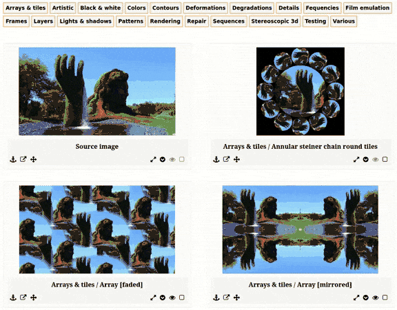

[See demos online.](https://jpfleury.github.io/gfo-demos/)

## Overview

[G'MIC](https://gmic.eu) is a free and open-source image processing framework that comes with hundreds of filters. With so many options available, it can be hard to know where to start.

This is where [gmic-filters-overview](https://github.com/jpfleury/gmic-filters-overview) becomes useful. It lets you preview all non-interactive G'MIC filters at once on a single image. Just run the script and enjoy all filters applied automatically to your image. Then, view the results in a convenient HTML file offering a few JavaScript functions like source image comparison.

## Requirements

To generate images from the command line:

- Bash (tested on GNU/Linux)
- G'MIC (latest version tested: 2.9.4)

## Installation

[Download the archive of the latest version](https://github.com/jpfleury/gmic-filters-overview/archive/master.zip) and extract it. That's it. gmic-filters-overview is ready to be used by the current user.

## Usage

**Note:** For this documentation, let's say the resulting folder from extracting the archive is `~/gmic-filters-overview-master` and the user navigated to this directory using a console (`cd ~/gmic-filters-overview-master`).

gmic-filters-overview consists of two parts: the Bash script to generate images (back-end) and the HTML file to view the results (front-end).

### Generate images (Bash script)

To display help and all command line options, run the script with the **`-h` option**:

	./gmic-filters-overview.sh -h

The two main options are the source image and the HTML working folder. If no options are passed:

	./gmic-filters-overview.sh

a default sample image will be used and an HTML working folder will be created inside the script folder, as if the command line were the following:

	./gmic-filters-overview.sh -s data/sample.jpg -w user/html

The source image is the one used to apply all filters. It's set with the **`-s` option**:

	./gmic-filters-overview.sh -s /path/to/source-image

The HTML working folder is the location where the HTML file is created and the images are saved. It will be created if it doesn't exist. It's set with the **`-w` option**:

	./gmic-filters-overview.sh -w /path/to/html-working-folder

If the HTML working folder exists and was previously used by gmic-filters-overview, the **`-d` option** can be used to delete files before generating new ones.

By default, all filters from all filter categories are used. The **`-c` option** allows you to restrict filter categories to the specified list:

	./gmic-filters-overview.sh -c "Arrays & Tiles",Colors

In this example, only filters from *Arrays & Tiles* and *Colors* will be included. Categories must be separated by commas. Category names containing spaces must be quoted.  If set to `CATEGORIES`, the list of possible choices will be displayed.

Another way to select a subset of all available filters is to copy the file `data/filters.tsv` as `user/data/custom-filters.tsv` and edit the copy. It contains the list of filters used by the script. A filter can be disabled by commenting its line (i.e., adding the character `#` at the beginning of the line).

Applying hundreds of filters can take a long time for large images. In such cases, it's advisable to resize the source image before applying filters. It can be done with the **`-r` option**:

	./gmic-filters-overview.sh -r 750,500

In this example, the source image is resized to 750 × 500 px. Note that the original image is not modified. A copy is created.

The script creates an HTML file. The **`-a` option** hides the "About" section by default (displayed at the beginning of the file).

The **`-o` option** allows you to automatically open the HTML file in the default browser.

If you want to use up-to-date filters from the current G'MIC version installed on your computer, you can pass the **`-f` option**, and an up-to-date filters file will be generated in `user/data/filters.tsv` and used by gmic-filters-overview. However, note that the file `user/data/custom-filters.tsv`, if it exists, will have precedence over `user/data/filters.tsv`.

To use filters from the current G'MIC version installed on your system, use the **`-f` option**. This will generate an up-to-date filters file in `user/data/filters.tsv`, which will be used by gmic-filters-overview. If `user/data/custom-filters.tsv` exists, it will take precedence over `filters.tsv`.

Some or all of these options can be combined:

	./gmic-filters-overview.sh -s /path/to/image -w /path/to/folder -c "Arrays & tiles",Colors -r 750,500 -a -d -o

After all images are generated, a log file is created at the root of the HTML working folder. It contains information about each filter used, such as filter name, command line, exit status, and running time. Errors (if any) are also listed.

#### Custom configuration

Default settings such as output formats, image quality, and command timeout are defined in `inc/config.sh`. To override these values, create a custom configuration file at `user/inc/config.sh`. It will be automatically loaded if it exists.

### View results (HTML file)

A file `index.html` is created at the root of the HTML working folder ([see demos online](https://jpfleury.github.io/gfo-demos/)) and provides an overview of each filter. Information and instructions are displayed at the beginning of the file.

## Development

Git is used for revision control. [The repository can be browsed online or cloned.](https://github.com/jpfleury/gmic-filters-overview)

## License

Author: Jean-Philippe Fleury (<https://github.com/jpfleury>)  
Copyright © 2015, 2025 Jean-Philippe Fleury

This program is free software: you can redistribute it and/or modify
it under the terms of the GNU General Public License as published by
the Free Software Foundation, either version 3 of the License, or
(at your option) any later version.

This program is distributed in the hope that it will be useful,
but WITHOUT ANY WARRANTY; without even the implied warranty of
MERCHANTABILITY or FITNESS FOR A PARTICULAR PURPOSE.  See the
GNU General Public License for more details.

You should have received a copy of the GNU General Public License
along with this program.  If not, see <http://www.gnu.org/licenses/>.

## Third-party code

- [Font Awesome](https://fontawesome.com): font license: SIL OFL 1.1; code license: MIT License
- [jQuery](https://jquery.com): MIT license
- [jQuery UI](https://jqueryui.com): MIT license
- [isInViewport](https://github.com/zeusdeux/isInViewport): MIT license
